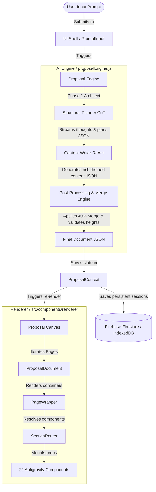

# ⚡ AI Proposal Generator — Developer Portal & Master Documentation

Welcome to the **AI Proposal Generator** developer portal! This dashboard acts as the unified index and entrance for all technical manuals, design documentation, and setup instructions.

This project is a high-end, responsive enterprise application designed to turn vague, single-sentence requirements into 8-12 page print-ready consulting proposals. It uses a **Two-Phase CoT (Chain-of-Thought) + ReAct** reasoning engine, is styled with maximum visual aesthetics, and generates unique layouts, themes, and content for each execution.

---

## 🗺️ Documentation Portal Directory

Please navigate to the specific guides below for comprehensive, end-to-end details:

| Manual | Focus Area | Description |
| :--- | :--- | :--- |
| 📖 [1. Architecture & Data Flow](file:///c:/Users/Chinm/Proposal-Generation-Agent-main/Proposal-Generation-Agent-main/docs/01_architecture_overview.md) | High-Level & Low-Level Design | Deep dive into the frontend-backend flows, the two-phase LLM planning, and the A4 Page Density budget engine. |
| 🧩 [2. Component Reference Spec](file:///c:/Users/Chinm/Proposal-Generation-Agent-main/Proposal-Generation-Agent-main/docs/02_component_specifications.md) | Visual Component Catalogue | Complete specifications of the 22 presentational Antigravity components, their react prop shapes, and layout constraints. |
| 🎨 [3. Color & Theme System](file:///c:/Users/Chinm/Proposal-Generation-Agent-main/Proposal-Generation-Agent-main/docs/03_theme_system.md) | Aesthetics & Dynamic Swapper | How the 12 pre-built HSL themes are defined, live-injected via CSS variables, and dynamically updated post-generation. |
| ⚡ [4. Prompt Engineering & Custom Gems](file:///c:/Users/Chinm/Proposal-Generation-Agent-main/Proposal-Generation-Agent-main/docs/04_prompt_engineering_guide.md) | AI Prompts & Gemini Integration | Prompts for Phase 1 & 2, rules and copywriter instructions, plus manual configuration guides for **GEM 1 (Gemini Refiner)** and **GEM 2 (Elite BA)**. |
| 💻 [5. Developer & Operations Guide](file:///c:/Users/Chinm/Proposal-Generation-Agent-main/Proposal-Generation-Agent-main/docs/05_developer_guide.md) | Setup, Build & Deployment | Quick-start guide, package dependency breakdowns, PDF print engine configurations, and static/docker container deployments. |
| 🗄️ [6. Firebase & Database Schema](file:///c:/Users/Chinm/Proposal-Generation-Agent-main/Proposal-Generation-Agent-main/docs/06_database_schema.md) | Persistence & Session Data | Complete structure of Firestore collections (`users`, `sessions`, `sessionData`), indexing rules, and security configurations. |

---

## 🏗️ High-Level System Architecture

The project consists of three main boundaries: the **UI Shell**, the **Proposal Canvas (Renderer)**, and the **AI Engine** (two-phase LLM streaming and post-processing).

---

## 🌟 Key Platform Capabilities

1. **Two-Phase Intelligent Synthesis**: Solves long-context generation problems by first establishing structural boundaries (CoT) and then writing content specifically tuned to fill those boundaries (ReAct).
2. **Page Density Management**: Enforces strict print guidelines (A4 standards) via the **50% Rule**, **85% Ceiling**, and **40% Merge** to eliminate awkward orphan elements or blank trailing pages.
3. **Multi-Key API Rotation**: Rotates through API keys to handle strict rate limits during high-frequency enterprise utilization.
4. **Interactive Theme Customizer**: Injects primary, accent, card, and text values instantly on the client side using pure CSS custom properties, allowing instant restyling without re-generation.
5. **A4-Bound CSS Print Styling**: Features advanced print configurations making one-click PDF generation via `window.print()` feel natively packaged and seamless.

---

> [!TIP]
> For a quick setup, go straight to the **[Developer & Operations Guide](file:///c:/Users/Chinm/Proposal-Generation-Agent-main/Proposal-Generation-Agent-main/docs/05_developer_guide.md)** to install dependencies, configure environment files, and start coding in under 3 minutes!
