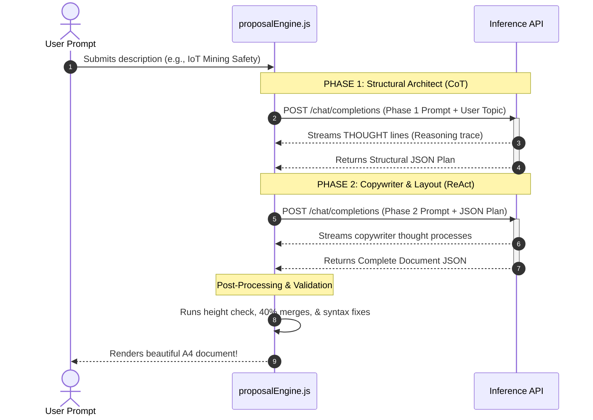

# 📖 Technical Architecture & Data Flow

This document details the software architecture, core pipelines, and layout algorithms that power the **AI Proposal Generator**.

---

## 1. System Topology Overview

The system is constructed as a React Single-Page Application (SPA) that acts as a secure client, communicating directly with Firestore/Firebase (for authentication and state sync) and the LLM inference endpoints (Groq/Azure API). 

```
┌────────────────────────────────────────────────────────────────────────┐
│                        CLIENT WORKSPACE (Vite + React)                  │
│                                                                        │
│   ┌─────────────────────────┐            ┌─────────────────────────┐   │
│   │        UI SHELL         │            │     PROPOSAL CANVAS     │   │
│   │  • PromptInput.jsx      │            │  • ProposalDocument.jsx │   │
│   │  • ChatThread.jsx       │            │  • PageWrapper.jsx      │   │
│   │  • ThinkingPanel.jsx    │            │  • SectionRouter.jsx    │   │
│   └────────────┬────────────┘            └────────────▲────────────┘   │
│                │                                      │                │
│                ▼                                      │                │
│   ┌───────────────────────────────────────────────────┴────────────┐   │
│   │                  ProposalContext (Global State)                │   │
│   │  - Stores active document, plans, themes, and versions         │   │
│   └────────────────────────────┬───────────────────────────────────┘   │
│                                │                                       │
│                                ▼                                       │
│   ┌────────────────────────────────────────────────────────────────┐   │
│   │                      proposalEngine.js                         │   │
│   │  - Executes phase orchestration, validation & post-processing  │   │
│   └────────────────────────────┬───────────────────────────────────┘   │
└────────────────────────────────┼───────────────────────────────────────┘
                                 │
                   HTTPS Request │ (LLM Inference API)
                                 ▼
                     ┌───────────────────────┐
                     │     Inference Host    │
                     │  - Groq (Llama 70B)   │
                     │  - Azure / Gemini API │
                     └───────────────────────┘
```

---

## 2. Global State & Context Layers

State is isolated into specialized React Context providers inside `src/context/` to separate concerns:

1. **`AuthContext`** — Coordinates login status, user information (Firebase Auth), and checkouts database permissions. Contains `isAdmin` flag retrieved from `/users/{uid}`.
2. **`ProposalContext`** — The global heart of the system. Manages:
   - `document`: The current parsed JSON structure of the proposal.
   - `documentVersions`: Array of past edits, allowing users to restore previous versions seamlessly.
   - `conversationHistory`: Tracks user refinements and conversational messages.
   - `isLoading`/`isRefining`: Control flags for page blockages and loading overlays.
   - `thoughts`: Streams CoT reasoning lines for UI presentation.
3. **`ImageStore`** — A local blob storage engine mapping `imageId` to Base64 data URLs. Triggers when users click an `ImagePlaceholder` and upload custom image files.
4. **`ImagePromptContext`** — Automatically analyzes the generated document to generate highly targeted text prompts for AI image creation systems (e.g. Infographics vs Professional Photos).

---

## 3. The Two-Phase AI Generation Pipeline

Generating multi-page documents directly with standard LLMs often fails due to structural fragmentation, generic templates, or lack of page boundaries. To solve this, the generator uses a **Two-Phase Chain-of-Thought (CoT) + ReAct** pipeline:



### Phase 1: Structural Planner (Architect)
- **Objective**: Decide the overall blueprint, the number of pages (7 to 10), color theme, layout styles, and components sequence.
- **Reasoning**: The model is forced to output a sequence of `THOUGHT:` lines answering 15+ key architectural questions (e.g. domain, target tone, component choices) before writing any JSON.
- **Output**: A lightweight JSON outline detailing pages, headers, and component list.

### Phase 2: Copywriter
- **Objective**: Translate the structural plan into rich, comprehensive, and high-fidelity copy.
- **Reasoning**: Takes the JSON plan, maps props for each specified component, injects specific technical terms (e.g. "HL7 FHIR" for MedTeal, "wearable mesh" for EarthGreen), and selects appropriate semantic icons.
- **Output**: A heavy JSON document containing the complete schema of the proposal pages.

---

## 4. A4 Page Density & Height Validation

To guarantee print compatibility and prevent empty spaces or clipped text blocks, the generator implements a mathematical page density layout algorithm inside `src/engine/proposalEngine.js`:

### The Height Budget Chart
Each component is assigned a percentage weight indicating its estimated height footprint on a standard A4 sheet:

| Component Name | Height Cost | Maximum Per Page | Placement Rule |
| :--- | :--- | :--- | :--- |
| `CoverPage` | **100%** | 1 | Must be page 1, section 1. |
| `SectionHeader` | **12%** | 2 | Must sit at the top of content sections. |
| `ChallengeCard` | **18%** | 3 | Can be stacked or inside grid components. |
| `FeatureCard` | **14%** | 4 | Best used inside grids. |
| `NumberedDeliverable` | **18%** | 3 | Full-width only. |
| `StatCard` | **12%** | 3 | Must sit inside a ThreeColumnGrid. |
| `DataTable` | **25%** | 2 | Detailed comparison layouts. |
| `WorkflowStep` | **38%** | 1 | Stacked workflow, vertical connectors. |
| `QuoteCallout` | **12%** | 2 | Accent line; full-width only. |
| `ImagePlaceholder` | **35%** | 1 | Maximum 3 per document; never 2 on a page. |
| `ContactFooter` | **16%** | 1 | Must sit at the very end of the document. |

### The Rules of Page Assembly

> [!IMPORTANT]
> **1. The 50% Rule**
> If a single component's weight is equal to or greater than **50%** of an A4 page, the engine isolates it. It will not allow other content (except headers/footers) to sit on the same page, preventing awkward line-wrapping.

> [!WARNING]
> **2. The 85% Ceiling**
> The cumulative weight of all components on a single page must never exceed **85%**. If adding a component would push the page height to 86% or above, a page break is automatically forced, and the component is pushed to the next page.

> [!TIP]
> **3. The 40% Merge Rule**
> Underfilled pages look unprofessional. If after rendering, any content page utilizes less than **40%** of its height budget, the engine attempts to merge it with adjacent pages by re-allocating grid columns or stacking components, optimizing density.

---

## 5. Render Resolution Flow

Once the JSON is finalized and validated, React resolves the structural items into visual elements:

```
[ProposalContext.document] 
       │
       ▼ (Map Pages)
[ProposalDocument.jsx] ── Injects theme CSS custom variables
       │
       ▼ (Iterate Pages)
[PageWrapper.jsx] ── Sets A4 sizing (210mm x 297mm), handles refine overlay
       │
       ▼ (Iterate Sections)
[SectionRouter.jsx] ── Matches 'componentType' to COMPONENT_REGISTRY
       │
       ├── Found ──────► Renders <Component {...props} />
       └── Not Found ──► Logs warning, skips rendering
```

If a component (e.g. `TwoColumnGrid` or `ThreeColumnGrid`) contains nested children, `SectionRouter` is called recursively to mount the grid items, maintaining absolute flexibility inside complex layouts.
