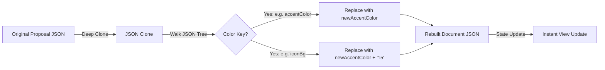

# 🎨 Color & Theme Customization System

Visual excellence and premium branding are the core design foundations of the **AI Proposal Generator**. This manual documents the pre-built themes, client-side CSS injection mechanism, post-generation recolor pipeline, and the dynamic brand color builder.

---

## 1. Predefined Corporate Palettes

The system has **12 curated color palettes** tailored for professional industries. Each theme defines a harmonious set of primary, accent, dark accent, card backgrounds, page backdrops, highlight, and text variables.

| Theme Name | Primary Hex | Accent Hex | Primary Target Industry |
| :--- | :--- | :--- | :--- |
| **Tech Blue** | `#1A56DB` | `#06B6D4` | SaaS, AI, Cloud Computing, Software |
| **Med Teal** | `#0E7490` | `#10B981` | Healthcare, Biotech, Diagnostics, Pharma |
| **Earth Green** | `#166534` | `#D97706` | Agriculture, Mining, Heavy Industry, IIoT |
| **Urban Slate** | `#334155` | `#3B82F6` | Smart City, Government Agencies, Logistics |
| **Startup Violet** | `#7C3AED` | `#F43F5E` | FinTech, Startups, EdTech, Venture Capital |
| **Ocean Cyan** | `#0891B2` | `#22D3EE` | Maritime, Environmental, Supply Chain |
| **Royal Indigo** | `#4F46E5` | `#818CF8` | Enterprise Platforms, Legal, Cybersecurity |
| **Sunset Coral** | `#E11D48` | `#FB923C` | Creative Agency, Media, Marketing |
| **Amber Gold** | `#B45309` | `#F59E0B` | Oil & Gas, Energy, Financial Consulting |
| **Forest Pine** | `#065F46` | `#34D399` | NGOs, Green Energy, Sustainable Design |
| **Midnight Rose** | `#9333EA` | `#EC4899` | Beauty, Lifestyle, Hospitality, Luxury B2B |
| **Steel Gray** | `#475569` | `#94A3B8` | Manufacturing, Automotive, Construction |

---

## 2. Injected CSS Variables Model

Themes are injected globally into the React DOM tree inside `src/components/renderer/ProposalDocument.jsx`. The root container resolves the active theme name and applies the styles as **CSS Custom Properties**:

```javascript
const cssVars = {
  '--primary': theme.primary,        // Dominant theme color (e.g. Header text, primary buttons)
  '--accent': theme.accent,          // Action and highlight color (e.g. Underlines, badges, border strips)
  '--dark': theme.dark,              // Deep dark color used for dark contact footer backgrounds
  '--bg': theme.bg,                  // Soft page background backdrop (A4 printable white/off-white)
  '--card-bg': theme.cardBg,          // Light card background tint
  '--highlight': theme.highlight,    // Intense highlight color for selected status cards
  '--text': theme.text,              // Deep body typography (usually `#1E293B` or brand dark)
  '--muted': theme.mutedText,        // Muted gray-blue typography (usually `#64748B`)
  '--divider': theme.divider,        // Decorative horizontal separation rule
};
```

All 22 Antigravity components consume these values natively, e.g. `style={{ backgroundColor: 'var(--card-bg)', color: 'var(--text)' }}`. This decouples visual style changes from the actual React DOM structure.

---

## 3. Dynamic Post-Generation Recoloring

Users can swop the theme of a proposal **instantly after generation** without making a new LLM request. This is achieved via `recolorDocument(doc, newAccentColor)` inside `src/themes/themes.js`:



### The Walk-and-Replace Algorithm
1. Performs a fast **deep clone** of the document via `JSON.parse(JSON.stringify(doc))` to protect state history.
2. Recursively walks every node in the page sections array.
3. Detects formatting keys matching: `accentColor`, `iconColor`, `dividerColor`, `color`.
4. Replaces color hex strings with the new chosen base hex color.
5. Dynamically converts background keys (`iconBg`, `cardBg`) into the chosen hex color appended with **`'15'`** (creating an **8.2% opacity alpha mask** to serve as a soft, translucent background tint).

---

## 4. Automated Brand Theme Builder

If an enterprise client has specific colors (such as a known logo color), the engine does not require pre-compiled rules. It calculates a customized corporate theme programmatically via the **`buildThemeFromColors`** algorithm:

```
                      ┌──────────────────────┐
                      │  Brand Base Color    │
                      │  Primary (e.g. BMW)  │
                      └──────────┬───────────┘
                                 │
                 ┌───────────────┼───────────────┐
                 ▼ (Mix 4% White)  ▼ (Mix 8% White)  ▼ (Mix 15% White)
           ┌───────────┐   ┌───────────┐   ┌───────────┐
           │ --bg color│   │ --cardBg  │   │--highlight│
           │  (96% WT) │   │  (92% WT) │   │  (85% WT) │
           └───────────┘   └───────────┘   └───────────┘
```

### White-Mixing Ratio Mathematics
The builder converts hex color values into standard RGB integers and applies a linear mixing scale with absolute white (`#FFFFFF`) at precise fractions:

$$\text{Tuned RGB} = \text{Base RGB} + (255 - \text{Base RGB}) \times (1 - \text{Ratio})$$

- **`--bg` Backdrop** (Ratio: **`0.04`**): Mixes $96\%$ white with $4\%$ brand color to output a clean, ultra-light background.
- **`--card-bg` Panels** (Ratio: **`0.08`**): Mixes $92\%$ white with $8\%$ brand color to provide structured contrast.
- **`--highlight` Outlines** (Ratio: **`0.15`**): Mixes $85\%$ white with $15\%$ brand color for distinct focus panels.

This mathematically ensures that regardless of how dark or saturated the client's brand color is, the text contrast, backdrops, and card frames will remain readable and elegant.
